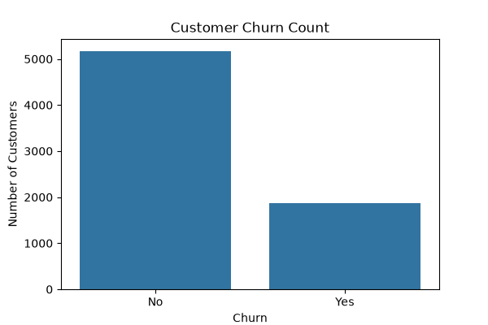

# 📊 Customer Churn Prediction System

A machine learning web application that predicts whether a telecom customer will stay or churn based on service usage data.

---

## 🚀 Live Demo
https://your-app-url.com

---

## 📌 Project Overview

This project uses **Machine Learning + Flask** to predict customer churn.  
It helps businesses identify customers likely to leave so they can take preventive actions.

---

## 🎯 Problem Statement

Telecom companies face high customer churn.  
This project aims to:

- Analyze customer behavior
- Identify churn factors
- Build a predictive ML model
- Provide real-time web predictions

---

## ⚙️ Features

- 📊 Data analysis & visualization
- 🤖 Machine learning model (Logistic Regression)
- 🌐 Flask web application
- 📈 Interactive dashboard
- 🔮 Real-time churn prediction
- 📉 Feature importance analysis

---

## 🧠 Machine Learning Model

- Algorithm: Logistic Regression  
- Accuracy: ~80%

### Input Features:
- Gender  
- Contract Type  
- Tenure  
- Monthly Charges  
- Internet Service  

---

## 🛠️ Tech Stack

- Python 🐍  
- Flask 🌐  
- Pandas, NumPy 📊  
- Scikit-learn 🤖  
- Matplotlib, Seaborn 📈  
- HTML, CSS 🎨  
- Joblib  

---

## 📁 Project Structure

customer_churn_analysis/
│
├── app.py
├── main.py
├── model.pkl
├── requirements.txt
│
├── data/
├── images/
├── static/
│ ├── style.css
│ ├── charts
│
├── templates/
│ ├── index.html
│ ├── dashboard.html
│ ├── prediction.html
│ ├── about.html
│ ├── contact.html
│
└── README.md

---

## 📊 Key Insights

- Monthly charges strongly affect churn
- Month-to-month contracts have highest churn
- Short tenure customers leave more often
- Fiber optic users have higher churn probability

---

## 🖥️ How to Run

### 1. Clone Repo

git clone https://github.com/your-username/customer_churn_analysis.git
cd customer_churn_analysis

---

## 📌 SAMPLE (HOW IT WILL LOOK ON GITHUB)

---

# 📊 Customer Churn Prediction System

A machine learning web application that predicts whether a telecom customer will stay or churn.

---

## 🚀 Live Demo
https://your-app-url.com

---

## ⚙️ Features
- ML model (80% accuracy)
- Flask web app
- Dashboard + prediction UI
- Real-time input prediction

---

## 📊 Key Insight
- Month-to-month customers churn more
- High monthly charges increase churn risk

---

## 🖥️ Output Screenshots

---

## 👨‍💻 Developer
Atharv Jadhav

---

# 🚀 If you want next level upgrade
I can also help you:

### 🔥 Make your GitHub profile LOOK PROFESSIONAL (like FAANG level)
- Profile README banner
- Badges (Python, ML, Flask)
- Animated GitHub intro
- Project showcase section

Just say 👍
